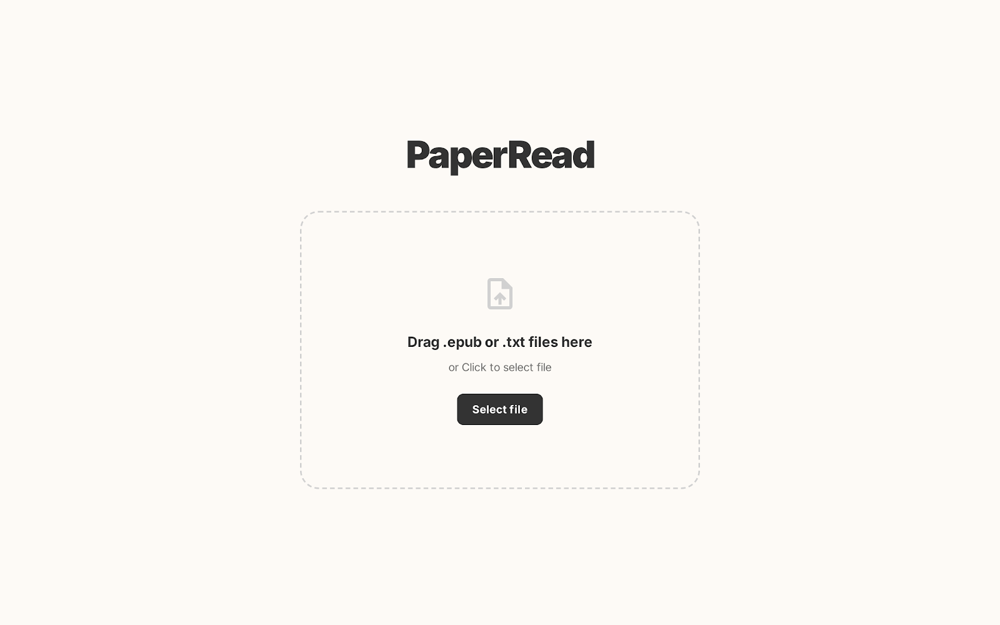

# ZenithAI Reader (PaperRead)

Static, privacy-first ebook reader with an optional FastAPI helper for offline text-to-speech (TTS). Books stay on-device, while configurable offline/online TTS providers let you listen without leaking content.

## Frontend setup
1. Install dependencies once: `npm install`.
2. Start the dev server (serves `public/` and the reader shell): `npm run dev`.
3. Run unit tests against the browser modules: `npm run test`.
4. Build production assets + service worker manifest: `npm run build`.

The dev server defaults to `http://localhost:5173`. It expects the backend below on `http://localhost:8750/tts` for offline voices.

## Backend (offline TTS helper)
1. Create a virtualenv inside `backend/` and install deps: `pip install -r backend/requirements.txt`.
2. Launch the FastAPI service: `uvicorn backend.tts_service.main:app --reload --port 8750`.
3. Run backend tests separately: `pytest backend/tests -q`.

The backend exposes `/tts` for offline synthesis plus `/tts/generate` as a pass-through for an online provider when you set `ONLINE_TTS_BASE_URL`.

## Docker deployment
1. Build the frontend once: `npm install && npm run build`.
2. From `backend/`, run `docker compose up --build`.
3. `app` serves the static bundle on `http://localhost:8080`; `tts` exposes FastAPI on `http://localhost:8750` with persistent media in `backend/media`.
4. Tear down with `docker compose down` when finished.

## Current status & roadmap
- Offline reader shell, library import, and OPFS/IndexedDB persistence are working.
- AI voice (online provider) is still in progress; current plan is to add both Chinese and English voice selections once the service contract is finalized.

## Screenshots

