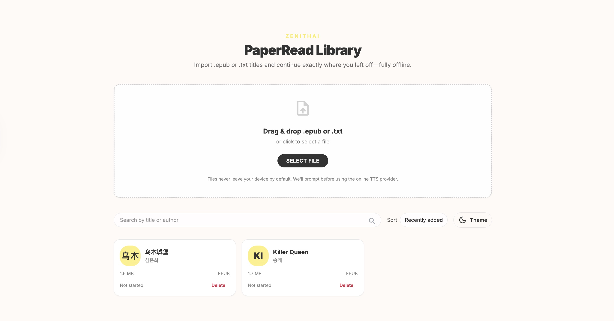
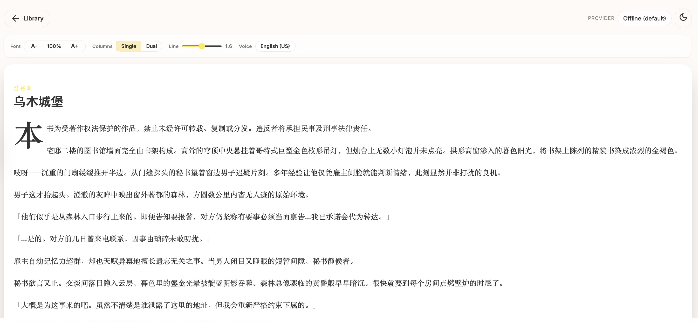

# ZenithAI Reader (PaperRead)

Static, privacy-first ebook reader with an optional FastAPI helper for offline text-to-speech (TTS). Books stay on-device, while configurable offline/online TTS providers let you listen without leaking content.

## Quick Start

### Option 1: Local Development (Recommended)

**Terminal 1 – Start Backend TTS Service:**
```bash
cd /path/to/ZenithAI-Reader
uvicorn backend.tts_service.main:app --reload --port 8750
```

**Terminal 2 – Start Frontend Dev Server:**
```bash
cd /path/to/ZenithAI-Reader
npm install          # first time only
npm run dev
```

Then open **http://localhost:5173** in your browser. The frontend will communicate with the backend at `http://localhost:8750/tts`.

### Option 2: Docker Deployment

**Build and run both services with Docker:**
```bash
npm install && npm run build    # build frontend assets first
cd backend
docker compose up --build
```

- **Frontend:** http://localhost:8080
- **Backend API:** http://localhost:8750

**Stop services:**
```bash
docker compose down
```

## Development

### Frontend
- **Install dependencies:** `npm install`
- **Dev server:** `npm run dev` (serves `public/` at http://localhost:5173)
- **Run tests:** `npm run test`
- **Production build:** `npm run build`

### Backend (offline TTS helper)
- **Setup virtualenv:** `python -m venv venv && source venv/bin/activate`
- **Install deps:** `pip install -r backend/requirements.txt`
- **Start server:** `uvicorn backend.tts_service.main:app --reload --port 8750`
- **Run tests:** `pytest backend/tests -q`

The backend exposes `/tts` for offline synthesis and `/tts/generate` as a pass-through when `ONLINE_TTS_BASE_URL` is configured.

## Current status & roadmap
- Offline reader shell, library import, and OPFS/IndexedDB persistence are working.
- AI voice (online provider) is still in progress; current plan is to add both Chinese and English voice selections once the service contract is finalized.

## UI Preview

**Library page** – Import .epub and .txt files with drag & drop, search and sort your collection:



**Reading experience** – Clean, customizable layout with adjustable fonts, themes, and TTS playback:



